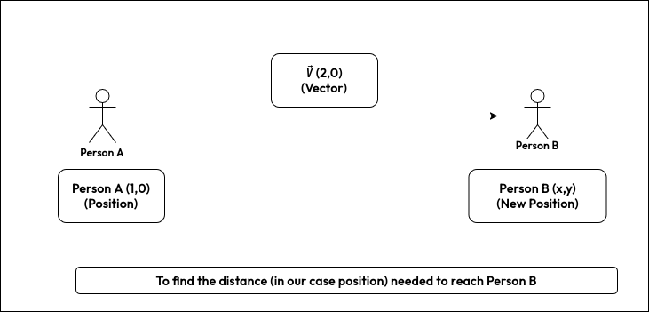
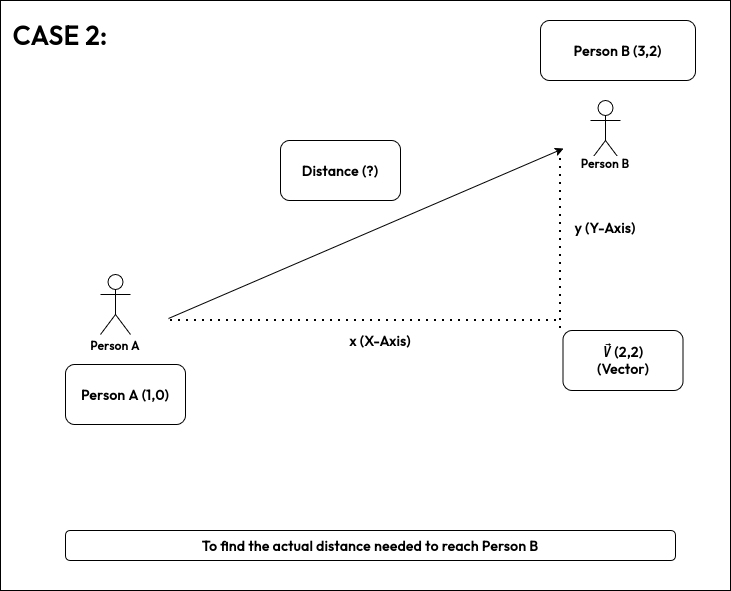
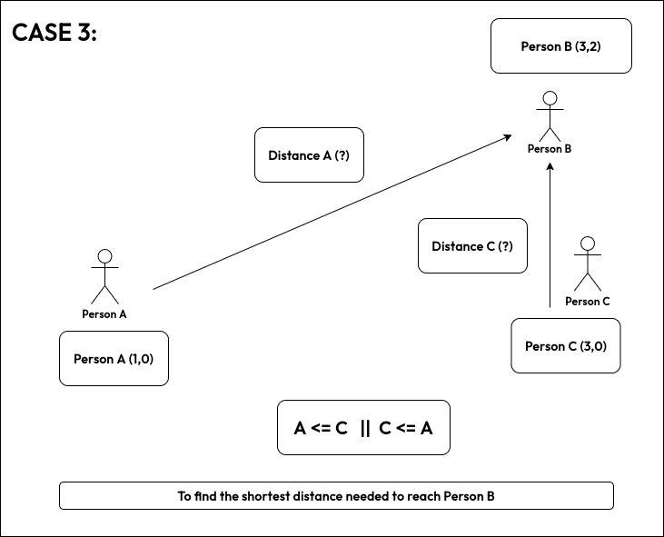
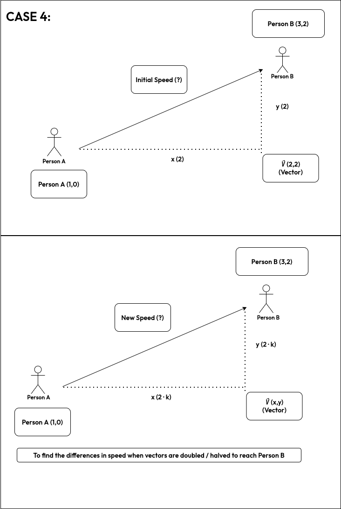
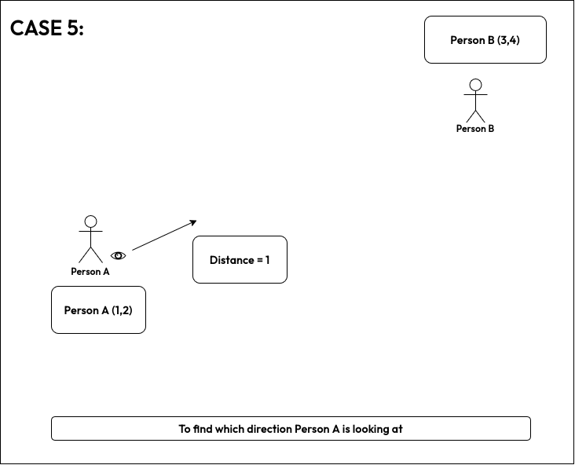
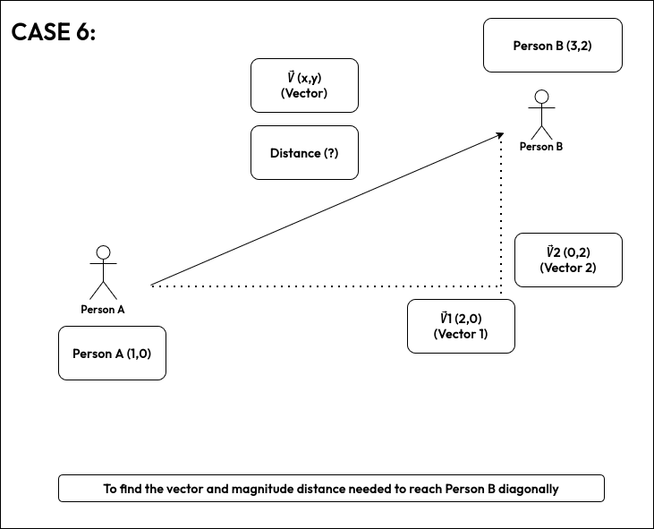

# Character Movement with vectors

## Main Formula (In Physics)
```
𝑃′ = 𝑃 + (𝑉⃗⋅Δ𝑡)
```

### Breakdown
- **𝑃′ (New Position)**: The updated coordinate vector for the next frame.
- **𝑃 (Current Position)**: The character's current coordinate vector.
- **𝑉⃗ (Velocity Vector)**: The displacement per unit of time (Direction × Speed).
- **Δ𝑡 (Delta Time)**: The time elapsed since the last frame (ensures Frame Rate Independence).

For our understanding we can remove elapsed time and simplify it as: 
```
𝑃′ = (𝑃x + 𝑉⃗x, 𝑃y + 𝑉⃗y)
```

**In simple words:** ***New Position = Old Position + Vector***

  
[C++ Working](main/demo.cpp)

----

## Case 1: Finding the Vector Distance

#### To find out how much vector distance Person A needs to travel to reach Person B:

So we have to find original vector... in that case we have to twist the formula a little bit:
```
𝑉⃗ = (𝑃′x - 𝑃x, 𝑃′y - 𝑃y)
```

**In simple words:** ***Vector = New Position - Old Position***

  
[C++ Working](case-1/demo.cpp)

----

## 🔑 Core Concept: One Formula, Multiple Meanings

### Vector Magnitude Formula
```
|V⃗| = √(Vx² + Vy²)
```

> This formula **always computes the length of a vector**.  
> The **meaning of that length** depends on what the vector represents.

### Interpretation Table

| Vector Represents | Meaning of \|V⃗\| |
|-------------------|-------------------|
| Displacement Vector | Distance |
| Velocity Vector | Speed |
| Scaled Velocity Vector | Faster or slower speed |
| Per-Frame Movement Vector | Distance traveled per frame |

> **Vectors do not carry physical meaning on their own.  
> Meaning comes from how the vector is used in the equation.**

----

## Case 2: Calculating Distance

#### To find out how much distance Person A has to travel to reach Person B:

So we have original vector... in that case we have to twist the formula a little bit to find the actual distance needed to travel to Person B:
```
|V⃗| = √(Vx² + Vy²)
```

- **|V⃗|** (Distance travelled)
- **𝑉⃗x** (x-component of the displacement vector)
- **𝑉⃗y** (y-component of the displacement vector)

**In simple words:** ***Distance = square root of (square of the 𝑉⃗x + square of the 𝑉⃗y)***

  
[C++ Working](case-2/demo.cpp)

----

## Case 3: Finding the Shortest Distance

#### To find out which distance is shortest to reach Person B:

So we have original vector & distance formula from above... in that case we have to twist the formula a little bit to find the shortest distance:
```
√(𝑉⃗1x² + 𝑉⃗1y²) <==> √(𝑉⃗2x² + 𝑉⃗2y²)

OR

(𝑉⃗1x² + 𝑉⃗1y²) <==> (𝑉⃗2x² + 𝑉⃗2y²)

i.e; 𝑉⃗1² <==> 𝑉⃗2²
```

- **𝑉⃗1** (Distance travelled) = Distance travelled by Person A to Person B
- **𝑉⃗2** (Distance travelled) = Distance travelled by Person C to Person B
- **<==>** = Comparison (less than or greater than or equal to)

**In simple words:** ***square of(Distance A) <==> square of(Distance B)***

  
[C++ Working](case-3/demo.cpp)

----

## Case 4: Vector Scaling

#### To increase or decrease how much distance a character moves **per frame** (Speeding Up and Slowing Down Using Vector Scaling):
```
|V⃗| = √(Vx² + Vy²)
|V⃗′| = k · |V⃗|
```

- **k** (Scale) = Scale of Difference
- **·** (Operator) = Increase or decrease Speed
- **|V⃗′|** (Speed) = Resulting Speed

  
[C++ Working](case-4/demo.cpp)

----

----

## Case 5: Finding Direction (Unit Vector)

#### To make a character **look at** or **move toward** another character *without caring about distance*:

We start with the **displacement vector** from Case 1, but instead of using its length, we **remove the magnitude** and keep only the **direction**.

### Step 1: Find the displacement vector

```
V⃗ = (𝑃′x - 𝑃x, 𝑃′y - 𝑃y)
```

This vector:

* Points from Person A to Person B
* Still contains distance information

---

### Step 2: Normalize the vector

```
V⃗unit = V⃗ / |V⃗|
```

Expanded:

```
V⃗unit = ( V⃗x / √(V⃗x² + V⃗y²),  V⃗y / √(V⃗x² + V⃗y²) )
```

* **|V⃗|** = Vector magnitude (from Case 2)
* **V⃗unit** = Unit vector (length = 1)

This is essential for:

* Character facing / aiming
* Movement with constant speed
* Steering behaviors
* Camera orientation
* Physics forces

---

### Using the unit vector for movement

Once normalized, speed is applied **separately**:

```
V⃗velocity = V⃗unit × speed
𝑃′ = 𝑃 + V⃗velocity
```

This ensures:

* Same movement speed regardless of distance
* Frame-independent, predictable behavior

---

### In simple words

***Direction = Vector ÷ Distance***

or

***Normalization removes distance and keeps only “which way.”***

---



[C++ Working](case-5/demo.cpp)

---

---

## Case 6: Vector Addition (Diagonal Movement)

#### To combine multiple movements or forces acting on a character (resulting in diagonal movement):

When a character is influenced by more than one direction at the same time (for example, moving right **and** down), we use **vector addition** to compute the final movement vector.

```
V⃗r = V⃗1 + V⃗2
V⃗r(x) = V⃗1x + V⃗2x
V⃗r(y) = V⃗1y + V⃗2y
```

After combining the vectors, the total distance (or speed) of the resulting movement is calculated using the vector magnitude formula:

```
|V⃗r| = √(V⃗rx² + V⃗ry²)
```

* **V⃗1** (Vector) = First movement or force (e.g., moving right)
* **V⃗2** (Vector) = Second movement or force (e.g., moving down)
* **V⃗r** (Vector) = Combined movement direction
* **|V⃗r|** (Distance / Speed) = Magnitude of the final movement

**In simple words:**
***Multiple directional movements combine into one vector, naturally producing diagonal motion.***

This allows characters to move diagonally **without special diagonal logic**, since diagonal movement is simply the result of adding horizontal and vertical vectors together.


[C++ Working](case-6/demo.cpp)

---


### Conceptual Summary

| Case        | What You Extract                |
| ----------  | --------------------            |
| Case 1      | Direction + Distance            |
| Case 2      | Distance                        |
| Case 3      | Distance Comparison             |
| Case 4      | Speed Control                   |
| Case 5      | Direction                       |
| Case 6      | Diagonal Direction + Distance   |

---
