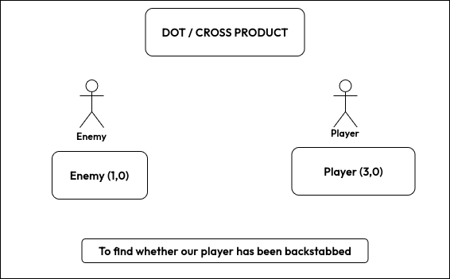

# Dot / Cross Product

## Core Vector Logic

To determine whether an enemy is **in front**, **behind**, or **to the side** of the player, we use **dot** and **cross** products on normalized direction vectors.

### Direction Vector

```
𝑉̂ = 𝑉 / |𝑉|
```

This removes magnitude and keeps only direction.

---

## Dot Product (Front / Back)

```
Dot = 𝑉₁ · 𝑉₂
```

* **Dot > 0.5** → Enemy in front
* **Dot < -0.5** → Enemy behind (**Backstab Situation**)

---

## Cross Product (Left / Right)

```
Cross = x₁·y₂ − y₁·x₂
```

* **Cross > 0** → LEFT
* **Cross < 0** → RIGHT

---

**In simple words:**
***Dot tells front/back, Cross tells left/right***


[C++ Working](main.cpp)

---
